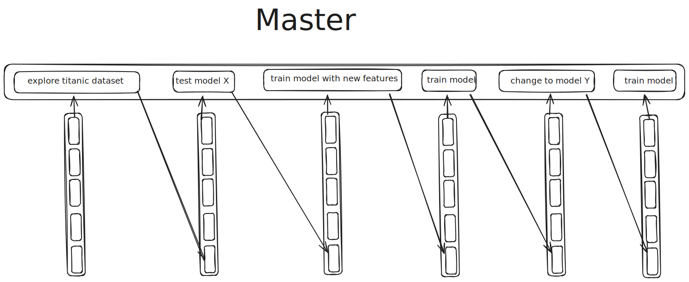

You can't sync a remote db to a local one, only the other way around.
We'll focus on doing the writes remotely then.

# Garder deux historiques:

## Comment les gérer?
Pour master on veut garder tout l'historique de commits.
Veut-on créer un mechanisme pour archiver the features branch?

### Example feature branching history
1. On fait plusieurs expériences et on garde une trace dans la db local.
2. Aprés plusieurs commits on a finalement un résultat satisfaisant. 
3. On crée une PR pour valider le résultat. Lors de la PR, on crée une nouvelle DB remote et on push tous les fichiers dans a bucket.
4. Reviewer fait un pull de la db. **Comment sync git avec l'historique?**
5. Review est acceptée. 

### Sync db avec git
- Avoir les sha des commits avec les fichiers du code.

### Files management
- Avoir une migration strategy pour passer les fichiers a des storages de plus en plus froids ou directement les effacer.
Selon si la branch est master ou juste une feature on pourrait vouloir garder une trace ou pas.

Store recent or frequently accessed Parquet files in a hot storage tier (e.g., Standard, Nearline).
Move older or less frequently accessed files to a colder storage tier (e.g., Coldline, Archive).
Define policies or triggers based on the age of the files or the number of commits on your master branch to automate the migration between storage tiers.
Eventually, based on your defined retention policies, delete files that are no longer needed.

we want to keep a history of many parquet files representing features for our machine learning models.  
we have a history tracking tool that knows how old those files are.
depending on how old are they and if they are related to our master branch we want to progressively move the data from the hotter storage to the colder one, 
and finally after X amount of time (maybe years or some X amount of commits on our master branch) we want to permanently delete them.

A single file will have a history of commits with changes that occurred to him (if enabled).
In this example we have a git ML project.
We discover the dataset, we create a couple of models, and we train them.
The git master branch will be sync with the master branches of multiple files.
We could have the following files:
- model.pkl
- features.parquet
- dump.parquet

* dump.parquet will only have a master branch. We'll do only once a big dump with a lot of data
* model.pkl will have a master with 2 commits and 1 branch (named "test model Y" that matches the git branch)
* features.parquet will have master and 3 branches (that match git). it will keep track of the changes.

Each branch for data will be a single database.


## Have a configuration general (per project) and per file
We should be able to manage configuration on a per file basis. if a file has no configuration associated use the default one.
[check this for better toml struct](https://toml.io/en/v1.0.0#table)
```
.yap/config

# turso settings
...

[author]
...

[general retention policy]
[branch "<branch name (master | any)>"]
# if hot_to_cold is not enabled, the file will be stored in the hotest storage because we asume that will be used or deleted quickly
# would we want to be able to skip some storage levels? for example keeping only on the hottest and the coldest?
# for features branches the hot_to_cold levels should be lower than for master according to what? if it's a PR we want them hot to be able to fetch them cheapply
hot_to_cold=bool
# this would be the storage to use. have one per file or use de default
storage = <>
# allow a couple of handy options like a history event "branch merged" or some git sync feature like "git branch deleted" otherwise focus on time only (<amount of> d,w,m,y)
delete_after = <aomout of><period> | <history event> | <git sync>
# we might not want to sync with git. we only want to keep track of some files separetlly.
# let's have two configs. One per project and one general.
sync_with_git = bool
remote_first = bool

[master]
hot_to_cold = true
delete_after = 2y

["change model"]
hot_to_cold = true
delete_after = 2 w

["train model *"]
hot_to_cold = false
delete_after = branch merged

["<file name>" retention policy]
...
```

## Configs
### General
Keep track of multiple files

## Remote first
Un historique avec les fichiers qui ont eté sauvegardé sur le storage.
Distribue et en ligne. (Remote first, ecrire directement sur la db remote).
En quelleque sorte c'est la branch "master" celle qui vas en prod. Un des veersions stageging

## Local First
Travailler en local, et lors d'un push, pusher seulement la dérvière vérsion en local.
Un historique des experiences locales.
(Local first, ecrire en local et plus tard si on veut, faire un push et creer une version distribue) 
Demander si cette option veut
etrê activée. Garder une copie des fichiers pour les comparer entre eux.

## We need to keep track of the branches
We'll have a database in the .yap in home. In there we'll keep track of all the files and branches
related to those files. Doing so we can know how many databases we have and we'll be able to manage
them easly

## Three steps:
* Add
* Commit
* Push

```
yap data add -p <someFile>
```
The file is added to the database (remte or local, to check).

```
yap data commit -p <someFile>
```
The file


### Add
Starts to keep track of a file.
It creates the first entry in the local database.
Ask if we want to keep a copy of the files locally to compare them on commit.

### Commit
- Creates a new entry in the database and compares the two files. 

#### Comparaison
Ask if we want to do that automatically for pipelines and/or CLI.
If we have the previous version compare the results. Compare them: 
- By hash
- If it's a parquet, columnar or something like so, use polars.
- If it's json, create structs, iter over k,v and compare.
- If it's plain text something like git.

#### Metadata
- If it's a pipeline, keep track of the whole graph?
- Timestamp
- Commit message
- If it's a git repo, get the commit hash? Or other info related to the git state?
- Have some info of the user:
    - Info from git if posible
    - For turso to handle users and differnts groups
    - For the remote storage. Probably to be able to have the credentials to push and pull files

### Push
- For production pipelines, push remote would be master and we would write directly to the remote db.
Except if manual intervention is needed. Saving after each pipeline, directly to the remote db would help to avoid
running pipelines again.
- When working locally. 
    We could want to push to a remote branch, in this case we add only the last commit. (or the ones selected)
    In case that we push to a new branch we could keep the first and last commit. (or the ones selected)
    If we want to keep track of all the experiments locally we could push all the db. (or the selected only)
